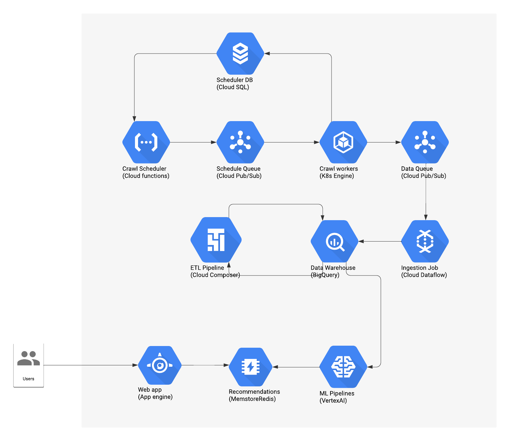
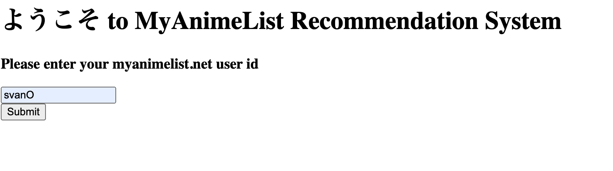

# Anime Recommendation System 
## Motivation
I have enjoyed watching anime ever since I was kid and I'll probably keep on enjoying anime for the rest of my life. <br /> However as I am going through the animes on my todo list, it is becoming harder and harder to find what to watch next. I am sure there are lots of gems that I would love to watch but how should I go about discovering them? <br /> One day I spent about an hour going through myanimelist.net searching for something to watch. Looking at how time consuming it was for me and probably for others, I decided to create an anime recommendation system that would recommend what to watch next for as many myanimelist users as possible.
<br /> <br />
At the time I was also preparing for the Google Cloud Professional Machine Learning Certifcation, so I decided that it would make sense to use as many different GCP services as possible for learning purposes. (I passed the certification BTW, thank you for asking :P )

## Goals
When I started this project I had a couple of ambitious goals:
- Create an end to end system.
- The system would continuously and intelligently crawl myanimelist.net for new data.
- The system would run an hourly ETL pipeline on the crawled data to generate clean and validated datasets.
- The system would run kubeflow based ML pipelines on the generated data to generate batch recommendations for the MAL users.
- The system would expose the recommendations through a web application.
- The system needs to easily scale on the cloud.
- The system would be implemented using good software, data and machine learning engineering practices.
- Crawl data for at least 1 million myanimelist users.
- Generate clean datasets and share them with the Kaggle community.
- Generate recommendations for at least 500K myanimelist users.
- Get at least 100 users to try it out in the first couple of weeks of releasing the web app and get their feedback.

## Non-goals
- Extensive experiementation with various machine learning algorithms and feature engineering techniques in order to get the best possible recommendations is not a goal of this project. 
- This could change with the help of the Kaggle community. Kagglers can experiment with the dataset and open PRs to integrate their ML algorithms to the ML pipelines and serve them on the web app.

## Architecture Design and components

The project is composed of 5 main parts:
- Crawl scheduler: A job that when called will fetch a list of anime or profile urls from a database and push them to a message queue.
The crawl schedulers are deployed as Cloud Functions, the database as postgres Cloud SQL db and the message queue as a Pub/Sub topic.
- Crawler: Scrapy jobs that that fetch message urls from the scheduler message queue and crawl them. The crawled data items are pushed to a data ingestion message queue and the crawler jobs also connect to the schedule database to update it. The crawler is deployed to Google Kubernetes Engine and the data ingestion queue is a Pub/Sub topic.
- Data Ingestion and ETL: An Apache Beam streaming job pulls data items from the ingestion queue and pushes them to BigQuery in a landing area. An Apache Airflow pipeline is run to aggregate, clean and validate the crawled data into well structured datasets. The new data is saved in BigQuery and Storage.
The ingestion beam job is deployed as a Dataflow job and the Apache Airflow ETL pipeline runs in a Cloud Composer environment.
- Machine Learning Pipelines: Each pipeline handles both retrieval and ranking steps. For retrieval step, the pipeline starts by generating the train/val/test data for retrieval, then trains a retrieval model and finally runs batch inference for retrieval and saves the results. For ranking step, the pipeline starts by generating the train/val/test data for ranking, then trains a ranking model and finally runs batch inference for ranking on the retrieved results and saves the final results. 
The pipelines are Kubeflow pipelines and they run on Google VertexAI pipelines. Data is fetched from and saved to both BigQuery and Storage.
- Web App: The generated recommendations are ingested into a Redis database and a small flask web application fetches the recommendations from Redis for each user recommendation request. 

### Crawl scheduler
The scheduler database contains two tables `anime_schedule` and `profile_schedule`. 
Both tables have the same schema:
```
    url VARCHAR(255) PRIMARY KEY NOT NULL,
    last_scheduled_date TIMESTAMP,
    scheduled_count INT,
    last_crawled_date TIMESTAMP,
    crawled_count INT,
    last_inspected_date TIMESTAMP,
    inspected_count INT
```
`url` is the anime/profile url on myanimelist. <br />
`last_scheduled_date` is the datetime of the last time the anime/profile was pushed to the schedule queue. <br />
`scheduled_count` is the number of times the anime/profile was pushed to the schedule queue. <br />
`last_crawled_date` is the datetime of the last time the anime/profile data item was pushed to the data ingestion queue. <br />
`scheduled_count` is the number of times the anime/profile data item was pushed to the data ingestion queue. <br />
`last_inspected_date` is the datetime of the last time the anime/profile was inspected when crawling another anime/profile. <br />
`inspected_count` is the number of times the anime/profile was inspected when crawling another anime/profile. <br />

When we call the scheduler to get the list of anime/profiles to crawl, it first returns those that have never been scheduled, then those that were last crawled a long time ago, then those that have been inspected not a long time. <br /> It also discards the anime/profiles that were scheduled not long ago but weren't crawled. There was an issue when crawling those anime/profiles and we don't want them to always be returned wheneveer we want to schedule animes/profiles.

### Crawler
We have anime and profile crawlers that can either crawl [myanimelist.net](https://myanimelist.net/) or the [Jikan API](https://docs.api.jikan.moe/). <br /> 
When we crawl an anime, we scrape:
- the anime info (title, score, synopsis, etc...)
- the anime's related animes (sequels, prequels, etc...) and update the "inspected" fields for the related anime in the scheduler db
- the animes that MAL users recommend for that anime and update the "inspected" fields for the recommended anime in the scheduler db
- the reviews for that anime and update the "inspected" fields for the users that reviewed it in the scheduler db
When we crawl a user, we scrape:
- the user's info (last online date, mean score etc...)
- the user's watch list (animes completed, plan to watch, watching etc...) and update the "inspected" fields for the animes in the scheduler db
- the user's latest activity (latest completed, watched anime) and update the "inspected" fields for the animes in the scheduler db
- the user's favorite animes and update the "inspected" fields for the animes in the scheduler db
- the user's friends and update the "inspected" fields for the new users in the scheduler db

The crawler can be run as crawl jobs that pull messages from the schedule queue and crawl the anime/profile urls in the pulled messages.
The crawler can also be run as a web service where you can issue requests for one or a list of animes/profile urls to be crawled. 
We can also issue a request to the crawl app to scrape a random list of anime url or profile urls from myanimelist and only update the scheduler DB. This will be used to start populating the scheduler DB (initial seed).

The crawlers can be configured to save the scraped data either locally in JSON files, directly to the BigQuery landing table or to a PubSub topic.

### Data Ingestion and ETL
When data is crawled, it is pushed to a PubSub topic. We then have a Dataflow job that pulls data from the PubSub topic and appends it to the corresponding BigQuery tables in a "landing area" (a BigQuery dataset). For more details on the landing tables schemas, see `etl/landing_area_schemas/`

Landing area is not clean. We could have duplicates (animes and profiles crawled more than once), inconsistencies, etc... We need to run an ETL pipeline that aggregates, merges and cleans up the data and saves it in a "staging area". After that the pipeline validates the data in the "staging area" and if it is valid, moves it to the "processed area".

Below is a description of the schema of the tables in the processed area:
#### Anime:
- anime_id: The id of the anime
- anime_url: The myanimelist url of the anime
- title: The name of the anime
- synopsis: Short description of the plot of the anime
- main_pic: Url to the cover picture of the anime
- type: Type of the anime (example TV, Movie, OVA etc...)
- source_type: Type of the source of the anime (example Manga, Light Novel etc..)
- num_episodes: Number of episodes in the anime
- status: The current status of the anime (Finished airing, Currently airing or Not yet aired)
- start_date: Start date of the anime
- end_date: End date of the anime
- season: Season the anime started airing on (example animes that started in Jan 2020 have season Winter 2020)
- studios: List of studios that created the anime
- genres: List of the anime genres (Action, Shonen etc..)
- scoore: Average score of the anime on myanimelist
- score_count: Number of users that scored the anime
- score_rank: Rank of anime based on its score on myanimelist
- popularity_rank: Rank of anime based on its popularity on myanimelist
- members_count: Number of users that are members of the anime
- favorites_count: Number of users that have the anime as a favorite anime
- watching_count: Number of users watching the anime
- completed_count: Number of users that have completed the anime
- on_hold_count: Number of users that have the anime on hold
- dropped_count: NNumber of users that have dropped the anime
- plan_to_watch_count: Number of users that plan to watch the anime
- total_count: Total number of users that either completed, plan to watch, are watching, dropped or have the anime on hold
- score_10_count: Number of users that score the anime a 10
- score_09_count: Number of users that score the anime a 9
- score_08_count: Number of users that score the anime a 8
- score_07_count: Number of users that score the anime a 7
- score_06_count: Number of users that score the anime a 6
- score_05_count: Number of users that score the anime a 5
- score_04_count: Number of users that score the anime a 4
- score_03_count: Number of users that score the anime a 3
- score_02_count: Number of users that score the anime a 2
- score_01_count: Number of users that score the anime a 1
- clubs: List of MAL clubs the anime is part of
- pics: List of urls too pictures of the anime

#### User
- user_id: The id of the user
- user_url: The url of the user on myanimelist
- last_online_date: Datetime of the last time the user logged into myanimelist.net
- num_watching: Number of animes the user is watching
- num_completed: Number of animes the user completed
- num_on_hold: Number of animes the user has on hold
- num_dropped: Number of animes the user has dropped
- num_plan_to_watch: Number of animes the user plans to watch
- num_days: Number of days the user has spent watching anime
- mean_score: Mean score the user has given to animes
- clubs: List of MAL clubs the user is member of


#### User Anime
Table contains relationships between user and animes
- user_id: The id of the user
- anime_id: The id of the anime
- favorite: 0 or 1 depending if anime_id is a favorite anime of user_id
- review_id: Id of the review if user_id reviewed anime_id
- review_date: Date the review was made
- review_num_useful: Number of users that found the review useful
- review_score: Overall score for the anime given in the review
- review_story_score: Story score for the anime given in the review
- review_animation_score: Animation score for the anime given in the review
- review_sound_score: Sound score for the anime given in the review
- review_character_score: Character score for the anime given in the review
- review_enjoyment_score: Enjoyment score for the anime given in the review
- score: Score the user has given to the anime (does not need to have given a review)
- status: Has the user "completed", "watching", "plan_to_watch", "dropped", "on_hold" the anime
- progress: Number of episodes the user has watched
- last_interaction_date: Last datetime the user has interacted with this anime

#### Anime Anime
Table contains relationships between pairs of animes
- animeA: The id of the first anime
- animeB: The id of the second anime
- recommendation: 0 or 1 depending if animeB is a recommendation of animeA
- recommendation_url: Url of the recommendation if animeB is a recommendation of animeA
- num_recommenders: Number of users that recommend animeB for animeA
- related: 0 or 1 depending if animeB is related to animeA
- relation_type: The type of relation between related animes (Sequel, Prequel etc...)

#### User User
Table contains relationships between pairs of users
- userA: The id of the first user
- userB: The id of the second user
- friends: 0 or 1 depending if userA and userB are friends
- friendship_date: Datetime that userA and userB became friends 

### ML pipelines
We currently have two type of approaches to recommend animes to users:
- Anime Anime recommendation: For each distinct anime we recommend a list of animes to watch next. Then for each user, based on the last anime it watched we recommend the animes recommended for that anime.
- User Anime recommendation: For each user we recommend a list of anime to watch next.

Below are some details on how the two approaches that are currently implemented:
#### Anime Anime
##### Retrieval step
For each animeA we select animeB that are related, have the most number of users that recommend them on MAL, have high cosine similarity of the genres and are co_completed by many users in a short period of time.
We use these pairs of animes to train a Tensorflow Recommenders Retrieval model.
We only use the anime ids as a features and pass them through an embedding layers. Experiemtation is needed to decide on which features to add and might be the focus of subsequent iterations on this project.
Once the model is trained we run batch inference and retrieve the top 300 animeB for each animeA.

#### Ranking step
The train/val/test dataset has 4 fields anime_id, retrieved_anime_id_1, retrieved_anime_id_2 and label. anime_id is the anchor anime and retrieved_anime_id_1
and retrieved_anime_id_2 are two potential retrieved animes. If label = 1 then retrieved_anime_id_1 is more relevant to anime_id than retrieved_anime_id_2. If label = 0 then retrieved_anime_id_2 is more relevant to anime_id than retrieved_anime_id_2.
We train a model to take anime_id and retrieved_anime and return a score.
During training, the model will return score_1 for (anime, retrieved_anime_id_1) and score_2 for (anime_id, retrieved_anime_id_2). If label = 1 we want score_1 > score_2 else score_1 < score_2.

We only use the anime ids as a features and pass them through an embedding layers. Experiemtation is needed to decide on which features to add and might be the focus of subsequent iterations on this project.

Once the model is trained, we iterate over all pairs of animes that we generated during the inference step of the retrieval model and get a score which will be used to rank the retrieved animes.

Now that we have ranked anime pairs, we can get ranked animes for each user based on the last anime it completed.

#### User Anime
##### Retrieval step
For each user_id we select anime_id that the user completed.
We use these (user_id, anime_id) pairs to train a Tensorflow Recommenders Retrieval model.
We only use the user ids and anime ids as a features and pass them through an embedding layers. Experiemtation is needed to decide on which features to add and might be the focus of subsequent iterations on this project.
Once the model is trained we run batch inference and retrieve the top 300 animes for each user_id.

#### Ranking step
- Ranking approach: We train a model that given (user_id, anime_id) tries to predict the score and minimize the MSE loss.
- List ranking approach: We train a model that given (user_id, list of anime_ids) tries to predict the scre for each anime and minimize the ListMLELoss using Tensorflow Recommenders Ranking.

Once the model is trained, we iterate over all pairs of (user, anime) that we generated during the inference step of the retrieval model and get a score which will be used to rank the retrieved animes.

### Web app
The generated recommendation are saved to a Redis database for low latency access.
When a user enters the web app, it will be asked to enter its MAL id

Once that is the app will show the user 5 random animes from the top 20 animes that we recommend for that user.


## Steps to run

## Future work

## Acknowledgements
